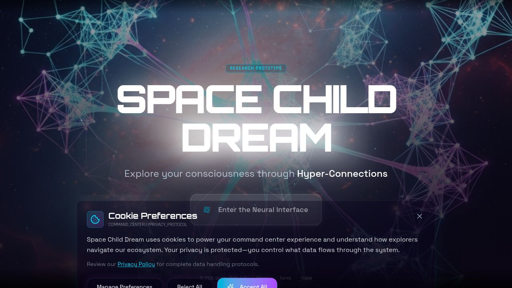

# Space Child Dream

A consciousness exploration platform based on the mHC (Manifold-Constrained Hyper-Connections) research from DeepSeek-AI. Users can explore consciousness through interactive AI-powered "consciousness probes" that generate poetic reflections with resonance and complexity scores.



## Table of Contents

- [Features](#features)
- [Tech Stack](#tech-stack)
- [Architecture](#architecture)
- [Getting Started](#getting-started)
- [Environment Variables](#environment-variables)
- [Database Schema](#database-schema)
- [API Reference](#api-reference)
- [Subscription Tiers](#subscription-tiers)
- [Authentication](#authentication)
- [Project Structure](#project-structure)
- [Development](#development)
- [Future Enhancements](#future-enhancements)
- [License](#license)

## Features

### AI-Powered Consciousness Probes
- Input thoughts and receive AI-generated poetic reflections
- Each probe returns resonance and complexity scores (0-100)
- Neural pattern visualization for each exploration
- Powered by OpenAI GPT models with adaptive prompts

### Custom Authentication System (Space Child Auth)
- Zero-knowledge proof (ZKP) foundation using circomlibjs
- JWT-based authentication with access/refresh token rotation
- Password hashing using bcrypt (12 rounds)
- Email verification and password reset flows
- Cross-subdomain SSO support with JWKS endpoint
- Token refresh with rotation and revocation

### Account Management
- Comprehensive account page with multiple tabs:
  - **Profile**: View and manage user information
  - **Usage**: Dashboard showing daily probes, total explorations, plan features
  - **History**: Browse thought history with resonance/complexity scores and reflections
  - **Subscription**: Manage billing and upgrade plans

### mHC Adaptive Prompt Engine
- System prompts stored in database and evolve over time
- Tier-specific prompts (free/pro/enterprise) or universal
- Safety constraints preserved during prompt evolution
- Prompt performance tracked via resonance and complexity metrics

### Subscription System (Stripe Integration)
- Three subscription tiers: Free, Pro, Enterprise
- Stripe Checkout integration for seamless upgrades
- Customer portal for subscription management
- Webhook handler with signature verification

### Social Sharing
- Share explorations publicly via unique URLs
- Twitter and LinkedIn share buttons
- Copy link functionality
- View counts and engagement tracking

### SEO Optimization
- Dynamic meta tags for social sharing
- JSON-LD structured data (WebApplication schema)
- Sitemap and robots.txt
- Dynamic OG image endpoint

## Tech Stack

### Frontend
- **React 19** - UI library
- **Vite 7** - Build tool and dev server
- **TypeScript** - Type safety
- **TailwindCSS 4** - Styling
- **Radix UI** - Accessible component primitives
- **Framer Motion** - Animations
- **TanStack Query** - Server state management
- **Wouter** - Lightweight routing
- **Zustand** - Client state management
- **React Hook Form + Zod** - Form handling and validation
- **Recharts** - Data visualization
- **Lucide React** - Icons

### Backend
- **Express.js** - Web framework
- **TypeScript** - Type safety
- **Drizzle ORM** - Database ORM
- **PostgreSQL** - Database
- **JSON Web Tokens** - Authentication
- **bcryptjs** - Password hashing
- **circomlibjs** - Zero-knowledge proof primitives
- **snarkjs** - ZK-SNARK library
- **Stripe** - Payment processing
- **Nodemailer** - Email sending
- **OpenAI SDK** - AI integration

## Architecture

```
┌─────────────────────────────────────────────────────────────────┐
│                         Client (React)                          │
│  ┌──────────┐  ┌──────────┐  ┌──────────┐  ┌──────────────────┐│
│  │   Pages  │  │Components│  │  Hooks   │  │   State (Zustand)││
│  └──────────┘  └──────────┘  └──────────┘  └──────────────────┘│
└─────────────────────────────────────────────────────────────────┘
                              │
                              ▼
┌─────────────────────────────────────────────────────────────────┐
│                      Express.js Server                          │
│  ┌──────────┐  ┌──────────┐  ┌──────────┐  ┌──────────────────┐│
│  │  Routes  │  │Middleware│  │ Services │  │  Storage (ORM)   ││
│  └──────────┘  └──────────┘  └──────────┘  └──────────────────┘│
└─────────────────────────────────────────────────────────────────┘
                              │
              ┌───────────────┼───────────────┐
              ▼               ▼               ▼
      ┌──────────────┐ ┌──────────────┐ ┌──────────────┐
      │  PostgreSQL  │ │   OpenAI     │ │    Stripe    │
      │   Database   │ │     API      │ │     API      │
      └──────────────┘ └──────────────┘ └──────────────┘
```

## Getting Started

### Prerequisites
- Node.js 20+
- PostgreSQL database
- OpenAI API key
- Stripe account (optional, for payments)

### Installation

1. Clone the repository:
```bash
git clone https://github.com/yourusername/space-child-dream.git
cd space-child-dream
```

2. Install dependencies:
```bash
npm install
```

3. Set up environment variables (see [Environment Variables](#environment-variables))

4. Push the database schema:
```bash
npm run db:push
```

5. Start the development server:
```bash
npm run dev
```

The application will be available at `http://localhost:5000`

### Available Scripts

| Command | Description |
|---------|-------------|
| `npm run dev` | Start development server |
| `npm run build` | Build for production |
| `npm run start` | Start production server |
| `npm run check` | Run TypeScript type checking |
| `npm run db:push` | Push schema changes to database |

## Environment Variables

### Required for Authentication
| Variable | Description |
|----------|-------------|
| `SESSION_SECRET` | JWT signing key |
| `DATABASE_URL` | PostgreSQL connection string |

### Required for AI Features
| Variable | Description |
|----------|-------------|
| `AI_INTEGRATIONS_OPENAI_API_KEY` | OpenAI API key |
| `AI_INTEGRATIONS_OPENAI_BASE_URL` | OpenAI base URL |

### Required for Payments (Optional)
| Variable | Description |
|----------|-------------|
| `STRIPE_SECRET_KEY` | Stripe secret key |
| `STRIPE_PRO_PRICE_ID` | Stripe price ID for Pro plan |
| `STRIPE_ENTERPRISE_PRICE_ID` | Stripe price ID for Enterprise plan |
| `STRIPE_WEBHOOK_SECRET` | Stripe webhook signing secret |

### Email Configuration (Optional)
| Variable | Description |
|----------|-------------|
| `SMTP_HOST` | SMTP server host |
| `SMTP_PORT` | SMTP server port |
| `SMTP_USER` | SMTP username |
| `SMTP_PASS` | SMTP password |
| `EMAIL_FROM` | From address for emails |

## Database Schema

### Core Tables

#### `users`
Stores user account information including email, password hash, and ZK credentials.

#### `thoughts`
Core consciousness probe data including:
- Input text from user
- AI-generated reflection
- Resonance score (0-100)
- Complexity score (0-100)
- Neural pattern array
- Public sharing settings

#### `prompt_versions`
Evolving system prompts for the mHC engine:
- Version number
- System prompt text
- Tier association (all/free/pro/enterprise)
- Performance metrics (resonance/complexity averages)

#### `subscriptions`
Stripe subscription data:
- Subscription ID and price ID
- Tier (free/pro/enterprise)
- Status (active/canceled/past_due)
- Billing period dates

#### `usage_ledger`
Token usage tracking for billing:
- Tokens consumed per action
- Action type (probe/share/export)
- Billing period

#### `shared_visualizations`
Public share records:
- Unique slug for sharing
- View and share counts
- OG image URL

### Authentication Tables

#### `zk_credentials`
Zero-knowledge proof credentials

#### `proof_sessions`
ZKP authentication sessions

#### `refresh_tokens`
JWT refresh token storage with revocation support

## API Reference

### Authentication Endpoints

| Method | Endpoint | Description |
|--------|----------|-------------|
| `POST` | `/api/space-child-auth/register` | Create new account |
| `POST` | `/api/space-child-auth/login` | Login with email/password |
| `POST` | `/api/space-child-auth/refresh` | Refresh access token |
| `GET` | `/api/space-child-auth/user` | Get current user |
| `POST` | `/api/space-child-auth/logout` | Logout and revoke tokens |
| `POST` | `/api/space-child-auth/verify-email` | Verify email address |
| `POST` | `/api/space-child-auth/forgot-password` | Request password reset |
| `POST` | `/api/space-child-auth/reset-password` | Reset password |
| `GET` | `/api/space-child-auth/.well-known/jwks.json` | JWKS endpoint |

### ZKP Authentication

| Method | Endpoint | Description |
|--------|----------|-------------|
| `POST` | `/api/space-child-auth/zk/request` | Create ZKP auth session |
| `POST` | `/api/space-child-auth/zk/verify` | Verify ZKP and authenticate |

### Application Endpoints

| Method | Endpoint | Description |
|--------|----------|-------------|
| `POST` | `/api/consciousness/probe` | Generate consciousness probe |
| `GET` | `/api/thoughts/history` | Get user's thought history |
| `GET` | `/api/usage/stats` | Get usage statistics |
| `POST` | `/api/thoughts/:id/share` | Share a thought publicly |
| `GET` | `/api/share/:slug` | Get shared thought data |

### Billing Endpoints

| Method | Endpoint | Description |
|--------|----------|-------------|
| `POST` | `/api/billing/checkout` | Create Stripe checkout session |
| `POST` | `/api/billing/portal` | Create customer portal session |
| `POST` | `/api/webhooks/stripe` | Stripe webhook handler |

### SEO Endpoints

| Method | Endpoint | Description |
|--------|----------|-------------|
| `GET` | `/sitemap.xml` | XML sitemap |
| `GET` | `/robots.txt` | Robots file |
| `GET` | `/api/og/:slug` | Dynamic OG metadata |

## Subscription Tiers

| Feature | Free | Pro ($9/mo) | Enterprise ($29/mo) |
|---------|------|-------------|---------------------|
| Daily Probes | 10 | 100 | Unlimited |
| History Retention | 7 days | 90 days | Unlimited |
| Export Data | No | Yes | Yes |
| Social Sharing | Yes | Yes | Yes |
| Prompt Evolution | No | Yes | Yes |
| API Access | No | No | Yes |
| Custom Prompts | No | No | Yes |

## Authentication

Space Child Auth is a custom authentication system built with security in mind:

### JWT Authentication Flow
1. User registers/logs in with email and password
2. Server returns access token (15 min expiry) and refresh token (7 day expiry)
3. Client stores tokens and includes access token in Authorization header
4. When access token expires, client uses refresh token to obtain new tokens
5. Refresh tokens are rotated on each use and stored in database for revocation

### Zero-Knowledge Proof Authentication
The system includes ZKP infrastructure for future wallet-based authentication:
- ZK credentials generated using circomlibjs (Poseidon hashing)
- Proof sessions for stateless verification
- JWKS endpoint for cross-domain token verification

### Password Security
- Passwords hashed with bcrypt (12 rounds)
- Minimum 8 character requirement
- Email verification required for new accounts
- Password reset via email with expiring tokens

## Project Structure

```
.
├── client/                    # Frontend React application
│   ├── public/               # Static assets
│   ├── src/
│   │   ├── components/       # React components
│   │   │   ├── ui/          # Radix UI primitives
│   │   │   └── *.tsx        # Feature components
│   │   ├── hooks/           # Custom React hooks
│   │   ├── lib/             # Utilities
│   │   ├── pages/           # Page components
│   │   ├── App.tsx          # Main app component
│   │   └── main.tsx         # Entry point
│   └── index.html           # HTML template
├── server/                   # Backend Express server
│   ├── middleware/          # Express middleware
│   ├── replit_integrations/ # AI integrations
│   ├── services/            # Business logic
│   │   ├── email.ts         # Email service
│   │   ├── prompt-evolution.ts
│   │   ├── space-child-auth.ts
│   │   └── stripe.ts
│   ├── db.ts                # Database connection
│   ├── index.ts             # Server entry point
│   ├── routes.ts            # API routes
│   ├── space-child-auth-routes.ts
│   └── storage.ts           # Database operations
├── shared/                   # Shared code
│   ├── models/              # Data models
│   │   ├── auth.ts          # Auth tables
│   │   └── chat.ts          # Chat models
│   └── schema.ts            # Drizzle schema
├── attached_assets/          # Uploaded assets
├── drizzle.config.ts        # Drizzle configuration
├── package.json
├── tsconfig.json
└── vite.config.ts           # Vite configuration
```

## Development

### Code Style
- TypeScript strict mode enabled
- Functional React components with hooks
- Tailwind CSS for styling with dark theme
- Cyan/purple gradient aesthetic
- Space/neural network visual motifs

### Database Migrations
Use Drizzle Kit for schema changes:
```bash
npm run db:push
```

### Adding New Features
1. Define data models in `shared/schema.ts`
2. Implement storage operations in `server/storage.ts`
3. Create API routes in `server/routes.ts`
4. Build UI components in `client/src/components/`
5. Create pages in `client/src/pages/`

## Future Enhancements

- Integration with Google's longfellow-zk library for production ZKP
- Wallet-based authentication using ZKP credentials
- Complete proof session verification flow
- Public gallery of shared explorations
- Team/organization accounts for Enterprise
- Custom branding options
- Advanced analytics dashboard
- Mobile application

## License

MIT License - see LICENSE file for details.

---

Built with consciousness by Space Child Dream
